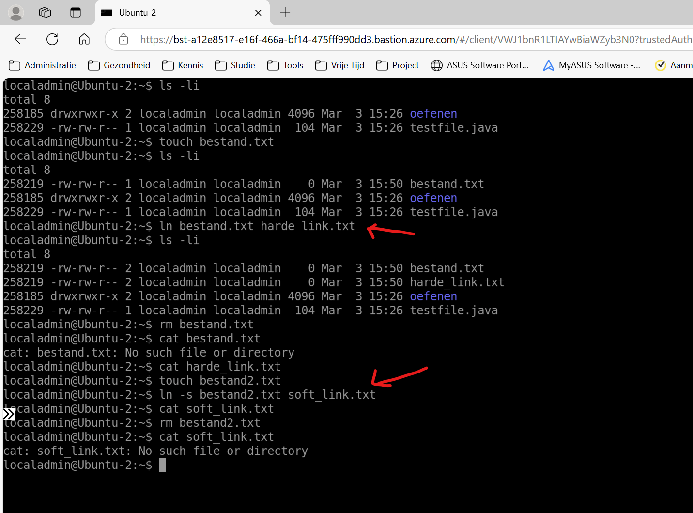
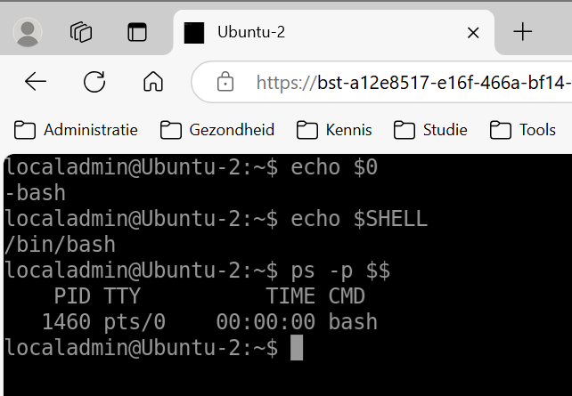

# Linux - opdracht 1

## Basiscommando's

**a)** Listing files. Met welk commando kun je alle .java files op het systeem tonen die voldoen aan de 
volgende voorwaarden : 
* ze zijn de afgelopen week aangepast 
* ze bevatten de string "Main" 

*Uitwerking*

Allereerst maak ik een document die aan de voorwaarden voldoet. namelijk een .java bestand met de tekst 'Main'.
Vervolgens zoek ik het bestand met de find commando.

```
localadmin@Ubuntu-2:~$ echo 'public class TestMain { public static void main(String[] args) { System.out.println("Main method"); } }' > testfile.java
localadmin@Ubuntu-2:~$ find / -type f -name "*.java" -mtime -7 -exec grep -l "Main" {} \; 2>/dev/null
/home/localadmin/testfile.java
```

`find / -type f -name "*.java" -mtime -7 -exec grep -l "Main" {} \; 2>/dev/null`

* `find /` is het commando om te zoeken in CLI waarbij / alles aangeeft.
* `-type f` geeft aan dat er alleen gezocht moet worden naar bestanden (fiels)
* `-name "*.java"` geeft aan dat de bestandsnaam moet eindigen op .java. daarbij is * een wildcard.
* `-mtime -7` zoekt naar bestanden die in de afgelopen 7 dagen zijn gewijzigd.
* `-exec grep -l "Main" {} \;` Met deze commando's wordt in een gevonden ebstand nagegaan of het de text "Main" bevat en toont vervolgens alleen de bestandsnamen.
* `2>/dev/null` verbergt foutmeldingen over bestanden waar geen toegang tot is.

*screenshot*


**b)** Links (bestanden). Wat is het verschil tussen een symbolische link en een gewone (harde) link? 
Hint : wat gebeurt er in beide gevallen als we de 'target' van de link verplaatsen of verwijderen?

*Uitwerking*

* Een gewone/harde link is een link naar de inode en de inhoud van een target bestand. 
* Een symbolische link werkt als een snelkoppeling naar een target bestand, die wijst naar het pad van het bestand.
Dat betekent dat het verwijderen van het target bestand verschillende gevolgen heeft:
* Bij de harde link blijft de verwijzing naar de inode en inhoud van het oorspronkelijk bestand bestaan, want de link is niet naar de bestandspad.
* Bij de softlink is de verwijzing naar het verwijderde bestandspad. Daardoor is de verwijzing doodlopend geworden. 

*Screenshot*



**c)** De shell. Hoe kun je zien welke Shell je gebruikt ? Hoe heet het startup script ?

Er zijn verschillende CLI commando's om te kunnen zien welke Shell je gebruikt.

* echo $0
De meest directe methode. (actieve shell)
* echo $SHELL
Laat de standaard Shell zien (/etc/passwd)
* ps -p $$
Dit weergeeft de actieve Shell. (shell-procesnaam)



Vervolgens bekijk ik het startup script (interactief):
`cat ~/.bashrc`

```
localadmin@Ubuntu-2:~$ cat ~/.bashrc
# ~/.bashrc: executed by bash(1) for non-login shells.
# see /usr/share/doc/bash/examples/startup-files (in the package bash-doc)
# for examples

# If not running interactively, don't do anything
case $- in
    *i*) ;;
      *) return;;
esac

# don't put duplicate lines or lines starting with space in the history.
# See bash(1) for more options
HISTCONTROL=ignoreboth

# append to the history file, don't overwrite it
shopt -s histappend

# for setting history length see HISTSIZE and HISTFILESIZE in bash(1)
HISTSIZE=1000
HISTFILESIZE=2000

# check the window size after each command and, if necessary,
# update the values of LINES and COLUMNS.
shopt -s checkwinsize

# If set, the pattern "**" used in a pathname expansion context will
# match all files and zero or more directories and subdirectories.
#shopt -s globstar

# make less more friendly for non-text input files, see lesspipe(1)
[ -x /usr/bin/lesspipe ] && eval "$(SHELL=/bin/sh lesspipe)"

# set variable identifying the chroot you work in (used in the prompt below)
if [ -z "${debian_chroot:-}" ] && [ -r /etc/debian_chroot ]; then
    debian_chroot=$(cat /etc/debian_chroot)
fi

# set a fancy prompt (non-color, unless we know we "want" color)
case "$TERM" in
    xterm-color|*-256color) color_prompt=yes;;
esac

# uncomment for a colored prompt, if the terminal has the capability; turned
# off by default to not distract the user: the focus in a terminal window
# should be on the output of commands, not on the prompt
#force_color_prompt=yes

if [ -n "$force_color_prompt" ]; then
    if [ -x /usr/bin/tput ] && tput setaf 1 >&/dev/null; then
# We have color support; assume it's compliant with Ecma-48
# (ISO/IEC-6429). (Lack of such support is extremely rare, and such
# a case would tend to support setf rather than setaf.)
color_prompt=yes
    else
color_prompt=
    fi
fi

if [ "$color_prompt" = yes ]; then
    PS1='${debian_chroot:+($debian_chroot)}\[\033[01;32m\]\u@\h\[\033[00m\]:\[\033[01;34m
\]\w\[\033[00m\]\$ '
else
    PS1='${debian_chroot:+($debian_chroot)}\u@\h:\w\$ '
fi
unset color_prompt force_color_prompt

# If this is an xterm set the title to user@host:dir
case "$TERM" in
xterm*|rxvt*)
    PS1="\[\e]0;${debian_chroot:+($debian_chroot)}\u@\h: \w\a\]$PS1"
    ;;
*)
    ;;
esac

# enable color support of ls and also add handy aliases
if [ -x /usr/bin/dircolors ]; then
    test -r ~/.dircolors && eval "$(dircolors -b ~/.dircolors)" || eval "$(dircolors -b)"
    alias ls='ls --color=auto'
    #alias dir='dir --color=auto'
    #alias vdir='vdir --color=auto'

    alias grep='grep --color=auto'
    alias fgrep='fgrep --color=auto'
    alias egrep='egrep --color=auto'
fi

# colored GCC warnings and errors
#export GCC_COLORS='error=01;31:warning=01;35:note=01;36:caret=01;32:locus=01:quote=01'

# some more ls aliases
alias ll='ls -alF'
alias la='ls -A'
alias l='ls -CF'

# Add an "alert" alias for long running commands.  Use like so:
#   sleep 10; alert
alias alert='notify-send --urgency=low -i "$([ $? = 0 ] && echo terminal || echo error)" 
"$(history|tail -n1|sed -e '\''s/^\s*[0-9]\+\s*//;s/[;&|]\s*alert$//'\'')"'

# Alias definitions.
# You may want to put all your additions into a separate file like
# ~/.bash_aliases, instead of adding them here directly.
# See /usr/share/doc/bash-doc/examples in the bash-doc package.

if [ -f ~/.bash_aliases ]; then
    . ~/.bash_aliases
fi

# enable programmable completion features (you don't need to enable
# this, if it's already enabled in /etc/bash.bashrc and /etc/profile
# sources /etc/bash.bashrc).
if ! shopt -oq posix; then
  if [ -f /usr/share/bash-completion/bash_completion ]; then
    . /usr/share/bash-completion/bash_completion
  elif [ -f /etc/bash_completion ]; then
    . /etc/bash_completion
  fi
fi
```

Vervolgens bekijk ik het startup script (login):
`cat ~/.profile`

```
localadmin@Ubuntu-2:~$ cat ~/.profile
# ~/.profile: executed by the command interpreter for login shells.
# This file is not read by bash(1), if ~/.bash_profile or ~/.bash_login
# exists.
# see /usr/share/doc/bash/examples/startup-files for examples.
# the files are located in the bash-doc package.

# the default umask is set in /etc/profile; for setting the umask
# for ssh logins, install and configure the libpam-umask package.
#umask 022

# if running bash
if [ -n "$BASH_VERSION" ]; then
    # include .bashrc if it exists
    if [ -f "$HOME/.bashrc" ]; then
. "$HOME/.bashrc"
    fi
fi

# set PATH so it includes user's private bin if it exists
if [ -d "$HOME/bin" ] ; then
    PATH="$HOME/bin:$PATH"
fi

# set PATH so it includes user's private bin if it exists
if [ -d "$HOME/.local/bin" ] ; then
    PATH="$HOME/.local/bin:$PATH"
fi

```

**d)** Piping. Wat is het commando om alle processen met in de PID“100” te tonen? 
(gebruik hierbij grep) 