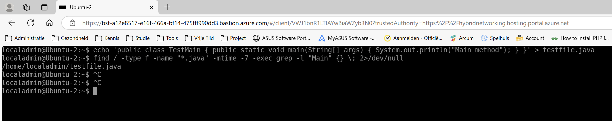

# Linux - opdracht 1


**a)** Listing files. Met welk commando kun je alle .java files op het systeem tonen die voldoen aan de 
volgende voorwaarden : 
* ze zijn de afgelopen week aangepast 
* ze bevatten de string "Main" 

*Uitwerking*

Allereerst maak ik een document die aan de voorwaarden voldoet. namelijk een .java bestand met de tekst 'Main'.
Vervolgens zoek ik het bestand met de find commando.

```
localadmin@Ubuntu-2:~$ echo 'public class TestMain { public static void main(String[] args) { System.out.println("Main method"); } }' > testfile.java
localadmin@Ubuntu-2:~$ find / -type f -name "*.java" -mtime -7 -exec grep -l "Main" {} \; 2>/dev/null
/home/localadmin/testfile.java
```

`find / -type f -name "*.java" -mtime -7 -exec grep -l "Main" {} \; 2>/dev/null`

* `find /` is het commando om te zoeken in CLI waarbij / alles aangeeft.
* `-type f` geeft aan dat er alleen gezocht moet worden naar bestanden (fiels)
* `-name "*.java"` geeft aan dat de bestandsnaam moet eindigen op .java. daarbij is * een wildcard.
* `-mtime -7` zoekt naar bestanden die in de afgelopen 7 dagen zijn gewijzigd.
* `-exec grep -l "Main" {} \;` Met deze commando's wordt in een gevonden ebstand nagegaan of het de text "Main" bevat en toont vervolgens alleen de bestandsnamen.
* `2>/dev/null` verbergt foutmeldingen over bestanden waar geen toegang tot is.

*screenshot*




**b)** Links (bestanden). Wat is het verschil tussen een symbolische link en een gewone (harde) link? 
Hint : wat gebeurt er in beide gevallen als we de 'target' van de link verplaatsen of verwijderen? 